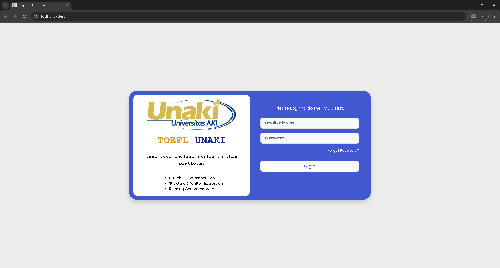

# Web TOEFL UNAKI v1
Website Application to TOEFL exam in UNAKI scale. For now, this project is live. The implementation results can be seen in the below.


## Features

- Authentication for all users
- TOEFL Exam Management (Admin, Lecturer): scheduling, reporting, etc.
- TOEFL Exam for students: exam, result, timer and anti-cheating


## Screenshots




## Run Locally

Clone the project

```bash
git clone https://github.com/brianajiks123/toefl-unaki.git
```

Go to the project directory

```bash
cd toefl-unaki
```

Install Dependencies (Laravel)

```bash
composer install
```

Install Dependencies (JavaScript)

```bash
npm install
```

Generate App Key

```bash
php artisan key:generate
```

Create Storage Symbolic Link

```bash
php artisan storage:link
```

Migrate Database (make sure already setup your environment in the .env file)

```bash
php artisan migrate --seed
```

Running Runtime

```bash
npm run dev
```

Running Development

```bash
php artisan serve
```


## Setup .env

- APP_NAME="TOEFL"
- DB_CONNECTION=mysql
- DB_HOST=127.0.0.1
- DB_PORT=3306
- DB_DATABASE=
- DB_USERNAME=
- DB_PASSWORD=
- MAIL_CLIENT_ID=
- MAIL_CLIENT_SECRET=
- MAIL_REFRESH_TOKEN=
- MAIL_USERNAME=
- MAIL_PASSWORD=

_Notes:_
- Change database port with available port and database connection
- Mail credentials using Google Cloud Platform (You need config the GCP for GMAIL)
- You can modify ".env.testing" and remove ".testing"


## User Testing

1. Admin
    
    email: admin@unaki.ac.id
    
    password: 12345678

2. Student

    email: testing@student.unaki.ac.id

    password: 12345678

**You can use file in "archives/question batch part" to testing upload question.**


## Tech Stack

**Frontend:** HTML5, CSS (Bootstrap), JavaScript

**Backend:** Laravel 11, MySQL, Apache Web Server


## Acknowledgements

 - [Laravel](https://laravel.com/docs/11.x)
 - [Bootstrap](https://getbootstrap.com/docs/5.3/getting-started/introduction/)


## Authors

- [@brianajiks123](https://www.github.com/brianajiks123)


## Used By

This project is used by the following companies:

- Universitas AKI (Plugin) | [Visit App](https://toeflsim.unaki.ac.id/)
